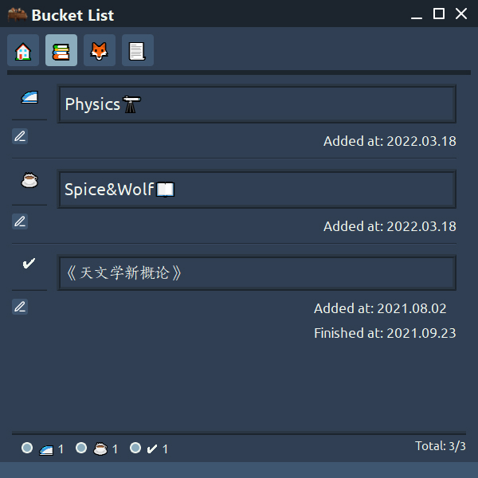

# BucketList

This is a simple tool for managing Bucket List (Life Plan).

## Installation

Download from [Github Release](https://github.com/Holence/BucketList/releases) to get the latest build for Windows.

or build with pyinstaller on your own:

`git clone https://github.com/Holence/BucketList.git`

`python -m venv env_build`

`.\env_build\Scripts\activate`

`pip install -r .\requirements.txt`

`pip install pyinstaller`

(you can install [UPX](https://upx.github.io/) to decrease the size)

build into One-Folder (you can delete the folder `translation` and file `qt.conf` in `./dist/BucketList/PySide2`, they are not needed):

`pyinstaller .\full.spec`

or build into single executable file:

`pyinstaller .\single.spec`

## Demo

Here is a demo:

